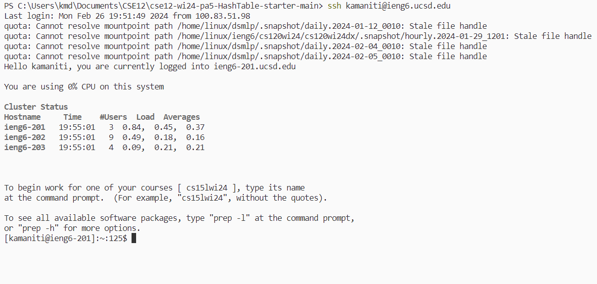
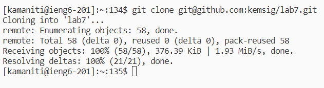
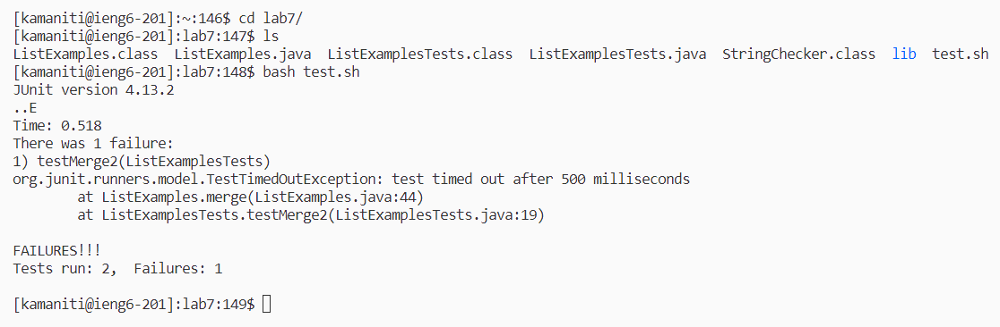
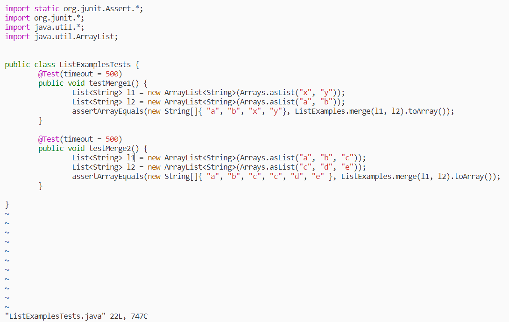
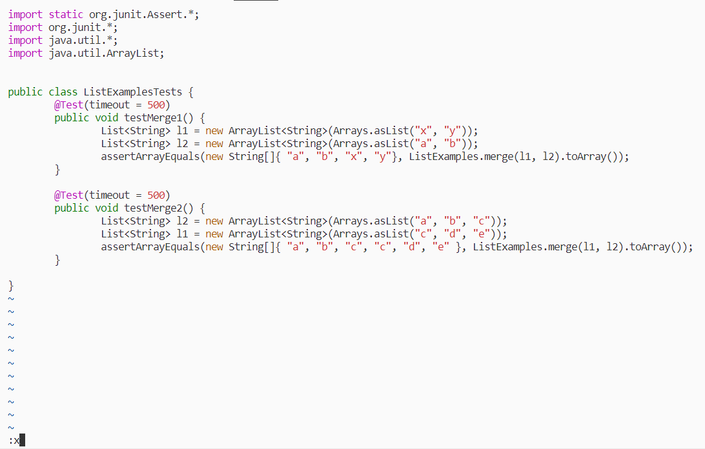
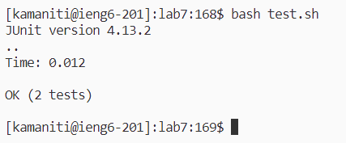
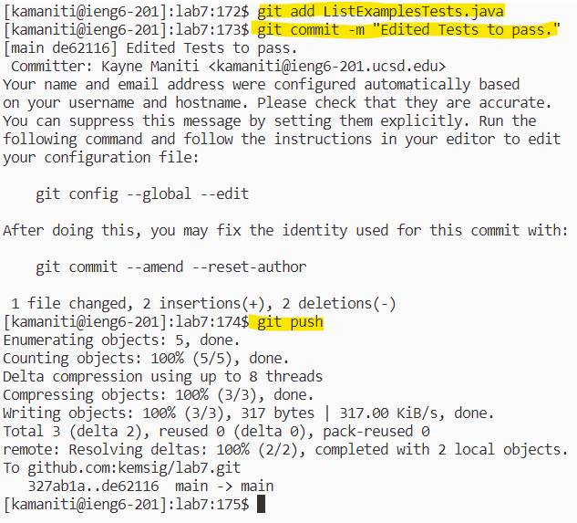

# Lab Report 4 - Vim (Week 7)

## Log-in.
Log into ```ieng6```

Use the ```ssh``` command. Make sure to replace ```user``` with your school username.
```
ssh <user>@ieng6.ucsd.edu
```
Example:


Keys pressed:
```
ssh <space> kamaniti@ieng6.ucsd.edu <enter> # to login
```
## Clone.
Clone your fork of the repository from your Github account (using the SSH URL)

In order to clone the repo of the fork we have to go to the website and copy the github link after pressing the ```code``` button. Make sure you are on the ssh tab and have set up ssh cloning for github on your ssh client.

Use the command.
```
git clone git@github.com:<user>/lab7.git
```

Example:




Keys pressed: (we already have the github link on clipboard)
```
git <space> clone <space> <ctrl> + v <enter> # cloning the repo
```
## Run the tests.
Run the tests, demonstrating that they fail.

We can run the script ```test.sh``` that is included in the repo to run our tests.

Example:




Keys pressed:
```
cd <space> lab7/ <enter> # to switch into the cloned folder.
ls <enter> # to see all of the files in the cloned folder.
bash <space> test.sh <enter> # to run the tests that are expected to fail.
```

## Fix the test.
Edit the code file to fix the failing test.

We know that the test fails on ```line 19``` on the ```assertEquals``` in ```ListExamplesTests.java```. On closer inspection of the code we can see that ```l1``` and ```l2``` need to swap positions in order for the tests to pass.

Test that fails:
```
public void testMerge2() {
    // we can swap l1 and l2 in order for this to pass.
    List<String> l1 = new ArrayList<String>(Arrays.asList("a", "b", "c"));
    List<String> l2 = new ArrayList<String>(Arrays.asList("c", "d", "e"));
    // Test below fails.`
    assertArrayEquals(new String[]{ "a", "b", "c", "c", "d", "e" }, ListExamples.merge(l1, l2).toArray());
}
```

In order to edit we need to use the **vim text editor** with the command:
```
vim <filename>
```
Example of entering vim (BEFORE):


Example of entering vim (AFTER):




Example of editng on vim.




Keys Pressed:
```
cat <space> ListExamplesTests.java <enter> # in order to diagnosis the bug.
vim <space> ListExamplesTests.java <enter> # Enter vim mode to make changes.

# enable numbers on the left so we know where to jump to the bug.
:set <space> number <enter> 

# jump to the line with bug (line 17)
:17 <enter>

# jump to l1 and change it to l2
f 1 # jumps to the first instance of 1 (translation: find 1)
r 2 # replaces the current character with the char 2 (translation: replace 2)

# go down a line to change the l2 to l1
j # goes down one line
r 1 # replace the current character with the char 1

# save and quit out of the file
: x <enter> # :x is the equavlient to :wq (write quit)
```

## Run the tests successfully.
Run the tests, demonstrating that they now succeed.

Now we that we have edited the tests they should now pass when we rerun the bash script.

Example:




Keys Pressed:
```
bash <space> tests.sh <enter> # to rerun the tests.
```

## Commit and Push
Commit and push the resulting change to your Github account (you can pick any commit message!)

There are three steps to this: **adding** the file to the staging area so it can be commited (we can also skip this and just use commit to stage all files), **commit** with a message in order to stage the files that were added, and then **push** it into the branch where we can see the changes on the repository.

Using ```git add```.
```
git add <files>
```

Using ```git commit```.
```
git commit -m "<message>"
```

Using ```git push```.
```
git push
```

Example:




Keys Pressed:
```
# add the edited tests into the staging area
git <space> add <space> ListExamplesTests.java <enter>

# commit the file into the staging area with a message
git <space> commit <space> -m <space> "Edited Tests to pass." <enter>

# push the changes to the repo
git <space> push <enter>

```