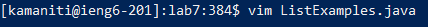
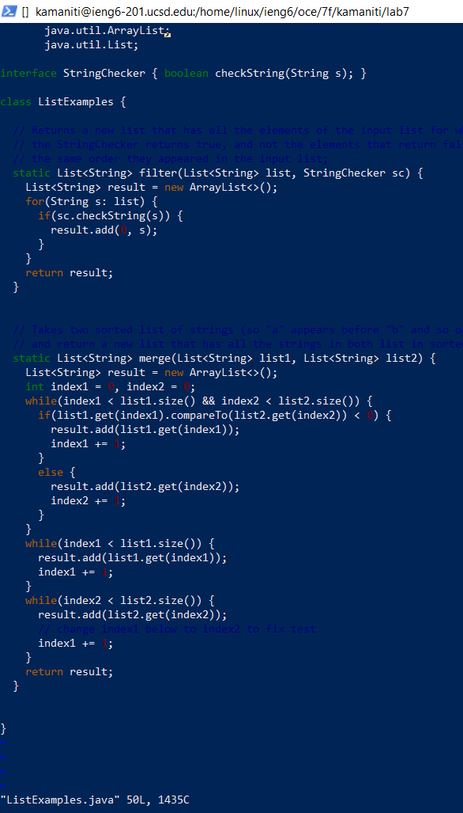
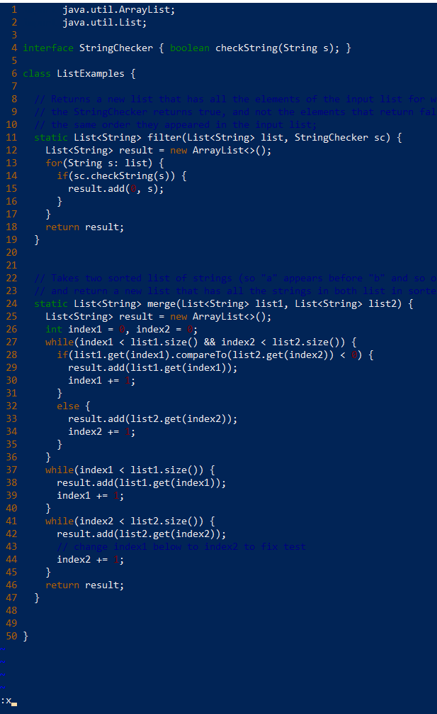

# Lab Report 4 - Vim (Week 7)

## Log-in.
Log into ```ieng6```

Use the ```ssh``` command. Make sure to replace ```user``` with your school username.
```
ssh <user>@ieng6.ucsd.edu
```
Example:


Keys pressed:
```
ssh <space> kamaniti@ieng6.ucsd.edu <enter> # to login
```
## Clone.
Clone your fork of the repository from your Github account (using the SSH URL)

In order to clone the repo of the fork we have to go to the website and copy the github link after pressing the ```code``` button. Make sure you are on the ssh tab and have set up ssh cloning for github on your ssh client.

Use the command.
```
git clone git@github.com:<user>/lab7.git
```

Example:


Keys pressed: (we already have the github link on clipboard)
```
git <space> clone <space> <ctrl> + v <enter> # cloning the repo
```
## Run the tests.
Run the tests, demonstrating that they fail.

We can run the script ```test.sh``` that is included in the repo to run our tests.

Example:


Keys pressed:
```
cd <space> lab7/ <enter> # to switch into the cloned folder.
ls <enter> # to see all of the files in the cloned folder.
bash <space> test.sh <enter> # to run the tests that are expected to fail.
```

Alternatively since we know there is only one ```test.sh``` file we can autofill by typing the first letter which in this case is "t" then pressing ```<tab>```. It is a cool trick to know, but for the sake of readibility in the writeup (so you can replicate this) I will be typing it out fully, but I will mention times where you can use it. It would look something like this.

```
bash <space> t <tab> <enter>
```

## Fix the test.
Edit the code file to fix the failing test.

We know that the test fails on ```line 42``` on the in ```ListExamples.java``` on the ```merge``` method because of the test output. On closer inspection of the code we can see that ```index1``` is incremented instead of ```index2``` which could be the cause of the error.

Test that fails between line 41-45:
```
while(index2 < list2.size()) {
      result.add(list2.get(index2));
      // change index1 below to index2 to fix test
      index1 += 1;
    }
```

In order to edit we need to use the **vim text editor** with the command:
```
vim <filename>
```

Alternatively we can just type the first letters of ```ListExamples.java``` to autofill, although there is another one call ```ListExamplesTest.java``` we can cycle through each instance with the ```<tab>``` button.

Example:
```
vim <space> Li <tab> <tab> <tab> .java <enter>
```

Example of entering vim (BEFORE):



Example of entering vim (AFTER):




Example of editng on vim.




Keys Pressed:
```
cat <space> ListExamples.java <enter> # in order to diagnosis the bug.
vim <space> ListExamples.java <enter> # Enter vim mode to make changes.

# enable numbers on the left so we know where to jump to the bug.
:set <space> number <enter> 

# jump to the line with bug (line 44)
:44 <enter>

# jump to the 1 on index1 to change it to index2
f 1 # jumps to the first instance of 1 (translation: find 1)
r 2 # replaces the current character with the char 2 (translation: replace 2)

# save and quit out of the file
: x <enter> # :x is the equavlient to :wq (write quit)
```

## Run the tests successfully.
Run the tests, demonstrating that they now succeed.

Now we that we have edited the tests they should now pass when we rerun the bash script.

Example:


Keys Pressed:
```
bash <space> tests.sh <enter> # to rerun the tests.
```

Alternatively we can use the **up-arrow** to go through our command history until we find the command ```bash test.sh``` and all we need to do is press ```<enter>```.

It would look something like:
```
<up> <up> <up> <up> <up> <enter>
```

## Commit and Push
Commit and push the resulting change to your Github account (you can pick any commit message!)

There are three steps to this: **adding** the file staging it so it can be committed (we can also skip this and just use commit to stage all files), **commit** with a message to save all the changes staged to the **local/origin** branch which is on our machine, and then **push** it into the **remote** branch where we can see the changes on the repository **online** on github.

Using ```git add```.
```
git add <files>
```

Using ```git commit```.
```
git commit -m "<message>"
```

Using ```git push```.
```
git push
```

Example (CORRECTION: *ignore us referencing ```ListExamplesTest.java``` we are instead referencing ```ListExamples.java```)*:


Keys Pressed:
```
# add the edited tests into the staging area
git <space> add <space> ListExamples.java <enter>

# commit the file into the staging area with a message
git <space> commit <space> -m <space> "Edited ListExamples.java." <enter>

# push the changes to the repo
git <space> push <enter>

```