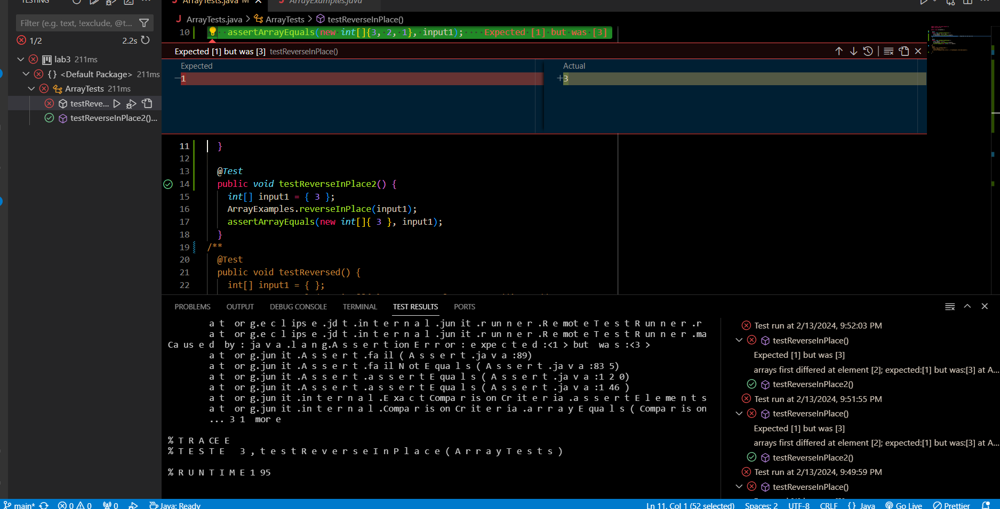

# Lab Report 3 - Bugs and Commands (Week 5)

## Part 1 - Bugs
During week 4 had explored various bugs in the following [repo](https://github.com/ucsd-cse15l-f23/lab3).

**A failure-inducing input for the buggy program, as a JUnit test and any associated code (write it as a code block in Markdown)**
When JUnit testing typically if you wrote your tester correctly, but your code is faulty, the tester will pose an error meessage. This means the input was failure-inducing.

The input that causes failure in this case is ```{1,2,3}```, because it fails to be the expected output of ```{3, 2, 1}```.

*The JUnit Test*
```
@Test 
public void testReverseInPlace() {
    int[] input1 = {1, 2, 3};
    ArrayExamples.reverseInPlace(input1);
    assertArrayEquals(new int[]{3, 2, 1 }, input1);
}
```

*The Code*
```
// Changes the input array to be in reversed order
static void reverseInPlace(int[] arr) {
    for(int i = 0; i < arr.length; i += 1) {
      arr[i] = arr[arr.length - i - 1];
    }
}
```

**An input that doesn't induce a failure, as a JUnit test and any associated code (write it as a code block in Markdown)**
Some tests are able to pass even when the code doesn't function as expected. This could be due to either: your code being faulty, your tester being fault, or both. When one test passes and others fail it is problematic because our overall test is inconclusive.


The input that doesn't cause failure is the int array ```{3}```. The faulty code doesn't reverse the array properly, and if the input is something that can't even be reversed the test will still pass. This particular input is problematic because it fails to test the full functionality of the method. That means this tester's outputs are inconclusive or the tester is faulty.

*The JUnit Test* 
```
@Test 
public void testReverseInPlace2() {
    int[] input1 = { 3 };
    ArrayExamples.reverseInPlace(input1);
    assertArrayEquals(new int[]{ 3 }, input1);
}
```

*The Code*
```
// Changes the input array to be in reversed order
static void reverseInPlace(int[] arr) {
    for(int i = 0; i < arr.length; i += 1) {
      arr[i] = arr[arr.length - i - 1];
    }
}
```

**The symptom, as the output of running the tests (provide it as a screenshot of running JUnit with at least the two inputs above)**

The failure when running the tester on the terminal.
```
JUnit version 4.13.2
..E
Time: 0.015
There was 1 failure:
1) testReverseInPlace(ArrayTests)
arrays first differed at element [2]; expected:<1> but was:<3>
        at org.junit.internal.ComparisonCriteria.arrayEquals(ComparisonCriteria.java:78)
        at org.junit.internal.ComparisonCriteria.arrayEquals(ComparisonCriteria.java:28)
        at org.junit.Assert.internalArrayEquals(Assert.java:534)
        at org.junit.Assert.assertArrayEquals(Assert.java:418)
        at org.junit.Assert.assertArrayEquals(Assert.java:429)
        at ArrayTests.testReverseInPlace(ArrayTests.java:10)
        ... 32 trimmed
Caused by: java.lang.AssertionError: expected:<1> but was:<3>
        at org.junit.Assert.fail(Assert.java:89)
        at org.junit.Assert.failNotEquals(Assert.java:835)
        at org.junit.Assert.assertEquals(Assert.java:120)
        at org.junit.Assert.assertEquals(Assert.java:146)
        at org.junit.internal.ExactComparisonCriteria.assertElementsEqual(ExactComparisonCriteria.java:8)
        at org.junit.internal.ComparisonCriteria.arrayEquals(ComparisonCriteria.java:76)
        ... 38 more

FAILURES!!!
Tests run: 2,  Failures: 1
```

*The failure on VSCode*


**The bug, as the before-and-after code change required to fix it (as two code blocks in Markdown)**

*Fixed Code*
```
// Changes the input array to be in reversed order
static void reverseInPlace(int[] arr) {
  for(int i = 0; i < arr.length/2; i += 1) {
    int temp = arr[i];
    arr[i] = arr[arr.length - i - 1];
    arr[arr.length - i - 1] = temp;
  }
}
```

*How it addresses the issue:*
In order to fix this bug we have to tackle the functionality of the code. Our tester has indicated that the ```reverseInPlace()``` function isn't reversing properly. When analyzing the code we can see that loop tries to overwrite the first half of elements with the last half of elements, but halfway through the loop the last half of elements are copied again because the first half of elements were overwritten with the last half of elements. My new code fixes this issue because it only goes half way through the list and swaps the first half of elements with the last half which doesn't end up overwriting any elements causing duplicates.

## Part 2 - Researching Commands
When working with so many commands it's only human to forget each of their names and functionalities. Plus each command may come with additional **command-line options** that can potential manipulate the output of the command. The best way to keep track of this is to *READ the DOCS*. One way to access the documentation on the terminal is through the ```man``` command or some commands come with a built in ```--help``` option to help you understand the functionality and tells you all of the command-line options.

In this part we are going to be ```find``` command. The **sources** we are going to be looking at is ```man find``` and ```find --help```. *I won't be putting the output of these commands because they are very long*. I also will be using other sources, which I will link on the specified section.

Using ```find```'s command-line options.
* ```find <path> -user <user>```

Ex 1:
```
kmd@DESKTOP-9D6Q5KL MINGW64 ~/Documents/Python/GitHub/docsearch (main)
$ find technical/biomed/ -user kmd
technical/biomed/
technical/biomed/1468-6708-3-1.txt 
technical/biomed/1468-6708-3-10.txt
technical/biomed/1468-6708-3-3.txt 
technical/biomed/1468-6708-3-4.txt 
technical/biomed/1468-6708-3-7.txt 
technical/biomed/1471-2091-2-10.txt
technical/biomed/1471-2091-2-11.txt
technical/biomed/1471-2091-2-12.txt
technical/biomed/1471-2091-2-13.txt
technical/biomed/1471-2091-2-16.txt
technical/biomed/1471-2091-2-5.txt 
technical/biomed/1471-2091-2-7.txt 
technical/biomed/1471-2091-2-9.txt 
...
```

Ex 2:
```
kmd@DESKTOP-9D6Q5KL MINGW64 ~/Documents/Python/GitHub/docsearch (main)
$ find technical/plos -user kmd
technical/plos
technical/plos/journal.pbio.0020001.txt
technical/plos/journal.pbio.0020010.txt
technical/plos/journal.pbio.0020012.txt
technical/plos/journal.pbio.0020013.txt
technical/plos/journal.pbio.0020019.txt
technical/plos/journal.pbio.0020028.txt
technical/plos/journal.pbio.0020035.txt
technical/plos/journal.pbio.0020040.txt
...
```
Here I use the ```find``` command with the user ```-user kmd```. This user is myself and it finds all of the files in that directory that my user owns. Why is this useful? If you have ever worked on a **shared cluster** multiple people are managing files in the shared drive. Let's say you need to find a file that **Bob** owns you would type in a command like ```find <path> -user Bob```. It's kind of difficult for me to show a real example with someone elses files without leaking private info so I will leave it to your own testing!

* ```find <path> --size <size>```

Ex 1.
```
kmd@DESKTOP-9D6Q5KL MINGW64 ~/Documents/Python/GitHub/docsearch (main)
$ find technical/plos/ -size +35k
technical/plos/pmed.0010028.txt
technical/plos/pmed.0010036.txt
technical/plos/pmed.0020018.txt
technical/plos/pmed.0020059.txt
technical/plos/pmed.0020073.txt
technical/plos/pmed.0020103.txt
technical/plos/pmed.0020182.txt
technical/plos/pmed.0020246.txt
technical/plos/pmed.0020249.txt
```

Ex 2.
```
kmd@DESKTOP-9D6Q5KL MINGW64 ~/Documents/Python/GitHub/docsearch (main)
$ find technical/plos/ -size -3k
technical/plos/
technical/plos/pmed.0020028.txt
technical/plos/pmed.0020048.txt
technical/plos/pmed.0020082.txt
technical/plos/pmed.0020120.txt
technical/plos/pmed.0020157.txt
technical/plos/pmed.0020191.txt
technical/plos/pmed.0020192.txt
technical/plos/pmed.0020226.txt
```

Using the ```-size``` option I can find files that are bigger, smaller, or equal to the size that I had specified. We can indicate this with the operands ```(+,-,<no operand>)```. We can also indicate if the size is kilobytes, megabytes, bytes, etc (```k,M,c```). This is useful if I am trying to find potentially malicious files or certain files. Usually certain file types have really large sizes (like a movie) or in worst-case **malware**. With this option we can find these files to maybe clear up storage, disect a virus, or to find a certain file.

* ```find <path> -exec <command> {} \;```
  * ```{}``` is the place holder of the file path
  * ```\;``` ends the operation
  * Source: https://www.baeldung.com/linux/find-exec-command

Ex 1.
```
kmd@DESKTOP-9D6Q5KL MINGW64 ~/Documents/Python/GitHub/docsearch/technical/911report (main)
$ find technical/911report -exec echo {} \;
chapter-1.txt
chapter-10.txt
chapter-11.txt
chapter-12.txt
chapter-13.1.txt
chapter-13.2.txt
chapter-13.3.txt
chapter-13.4.txt
chapter-13.5.txt
chapter-2.txt
chapter-3.txt
chapter-5.txt
chapter-6.txt
chapter-7.txt
chapter-8.txt
chapter-9.txt
preface.txt
```

Ex 2.
```
kmd@DESKTOP-9D6Q5KL MINGW64 ~/Documents/Python/GitHub/docsearch (main)
$ find * -name "*.sh" -exec cat {} \;
find $1 > find-results.txt
grep ".txt" find-results.txt > grep-results.txt
wc grep-results.txtjavac Server.java DocSearchServer.java
java -cp . DocSearchServer 9000 .javac -cp "lib\junit-4.13.2.jar;..\lib\hamcrest-2.2.jar" *      
```

When using the option ```exec``` we have to use the placeholder ```{}``` for the file path and ```\;``` to end the operation. In this we had used find on an entire folder and had it ```echo``` the file name. We had also used ```cat``` when we used ```find``` on all of the ```.sh``` files to see the contents of all the ```.sh``` files. This is useful if we want to do a mass amount of operations on the files that are returned from the ```find``` command.

* ```find <path> -type <type>```

Ex 1.
```
kmd@DESKTOP-9D6Q5KL MINGW64 ~/Documents/Python/GitHub/docsearch (main)
$ find technical/ -type d
technical/
technical/911report
technical/biomed
technical/government
technical/government/About_LSC
technical/government/Alcohol_Problems  
technical/government/Env_Prot_Agen     
technical/government/Gen_Account_Office
technical/government/Media
technical/government/Post_Rate_Comm    
technical/plos
```

Ex 2.
```
$ find technical/government/Alcohol_Problems/ -type f
technical/government/Alcohol_Problems/DraftRecom-PDF.txt
technical/government/Alcohol_Problems/Session2-PDF.txt
technical/government/Alcohol_Problems/Session3-PDF.txt
technical/government/Alcohol_Problems/Session4-PDF.txt
```

We had used the ```-type``` option to list all of the files in the directory that have that type. With type ```d``` meaning directory we had listed every single directory in ```/technical``` and with type ```f``` we had listed every file in ```technical/government/Alchohol_Problems```. This is useful if we want to find only specific types of files. Sometimes when we use commands it prompts an error because we can't use it on a directory or vice versa. This can help circumvent that issue.
