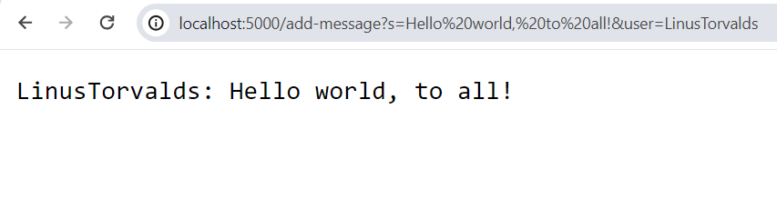
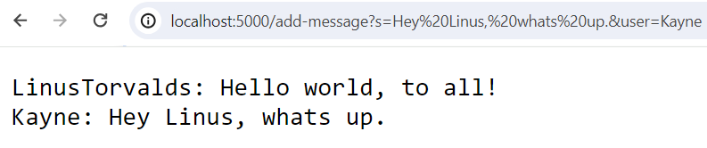
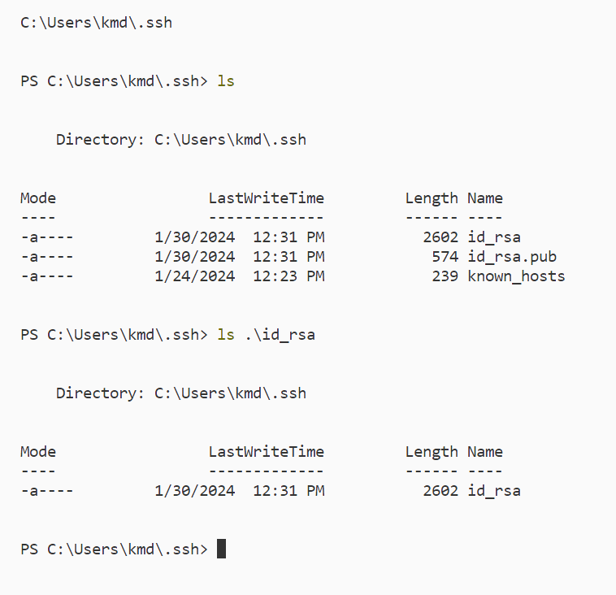
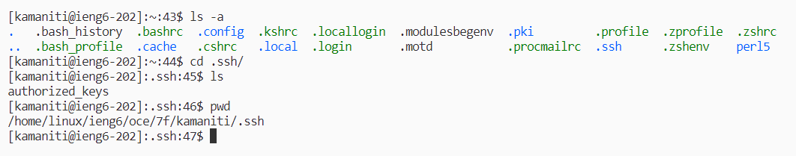
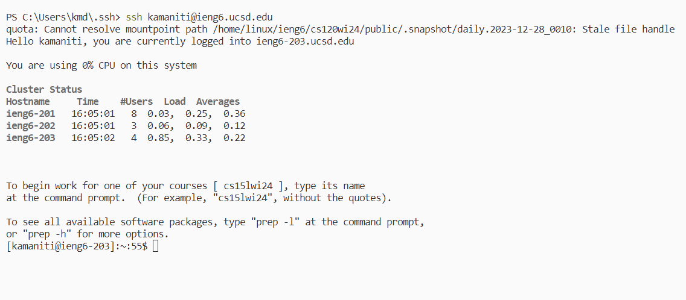

# Lab Report 2 - Servers and SSH Keys (Week 3)
## Part 1 - Servers
A **server** is basically a computer like the one you are using now, but it specializes in managing network resources.

For this lab we had written our own server in Java. This webserver is called ```ChatServer```. It's goal is to take in two parameters ```s=<String>``` and ```user=<String>``` then concatenate them to be a single string with the fromat ```user: s```.

*For more info on the instructions visit [here](https://ucsd-cse15l-w24.github.io/week3/index.html)*.

**Here is the code I wrote:**

ChatServer.java
```
import java.io.IOException;
import java.net.URI;
import java.util.ArrayList;

class Handler implements URLHandler {
    ArrayList<String> messages = new ArrayList<>();

    public String handleRequest(URI url) {
        if (url.getPath().equals("/")) {
            return messagesToString();
        } else if (url.getPath().equals("/add-message")) {
            String[] parameters = url.getQuery().split("&");
            String s_param = parameters[0].split("=")[1];
            String user_param = parameters[1].split("=")[1];

            messages.add(user_param + ": " + s_param);
            return messagesToString();
            // edit below
        } else {
            return "404 Not Found!";
        }
    }

    public String messagesToString(){
        String total = "";
        for (String message : messages){
            total += message + "\n";
        }
        return total;
    }
}

class ChatServer {
    public static void main(String[] args) throws IOException {
        if(args.length == 0){
            System.out.println("Missing port number! Try any number between 1024 to 49151");
            return;
        }

        int port = Integer.parseInt(args[0]);

        Server.start(port, new Handler());
    }
}
```

Now that we have written, compiled and launched our server we can now start testing.

*For reference we had launched the server on:* ```http://localhost:5000/```

**Screenshot 1**
*Input:*
```
http://localhost:5000/add-message?s=Hello%20world,%20to%20all!&user=LinusTorvalds
```
*Output:*


**Which methods were called in the code?**
* ```String handleRequest(URI url)```
* ```String messagesToString()```
* ```String getPath()```
* ```boolean equals(Object compared)```
* ```String[] split(String regex)```

**What are the relevant arguments to those methods, and the values of any relevant fields of the class?**
* ```String handleRequest(URI url)```
    * This method allows us to interact with the URL and it's arguments. It then looks for the```/add-message``` command. It then looks at two queries and their contents, in this case ```?s=Hello%20world,%20to%20all!``` and ```&user=LinusTorvalds```. This is then concatenated into ```"LinusTorvalds: Hello world, to all!```and then this is added to ```ArrayList<String> messages```.
    * A relevant argument that is passed is ```URI url```. URI stands for *Uniform Resource Identifier*, which is our host url. So in our case its ```localhost:5000```. The ```url``` object can get the queries that the user typed.
* ```String getPath()```: We had used this to get the arguments that user put in this case its ```/add-message?s=Hello%20world,%20to%20all!&user=LinusTorvalds```.
* ```boolean equals(Object compare)```: We us this to find the command ```/add-message``` and all the arguments that the user inputted.
* ```String[] split(String regex)```: We had used this to extract the arguments from the String we get from ```getPath()``` in order to process it to be added to the ```messages``` array.
* ```ArrayList<String> messages```: This is a field. A concatenated String is added into this ArrayList and expands.
    
* ```String messagesToString()```
    * This method acesses ```ArrayList<String> messages``` then goes through all of the items and then concatenates all of them into a singular string. This is so the web page can return all of the messaging content, but nothing changes.
    * A field variable accessed is ```ArrayList<String> messages```

**How do the values of any relevant fields of the class change from this specific request? If no values got changed, explain why.**
* A value that gets changed is ```ArrayList<String> messages```. This is because it had added a processed version of the users parameters from the URL into ```messages```. It adds ```LinusTorvalds: Hello world, to all!```.
* ```String parameters[]``` becomes ```{"s=Hello world, to all!", "user=LinusTorvalds"}``` (*note the %20's are the encoding for the space character in a URL*)
* ```String s_param```: this becomes ```"Hello world, to all!"```
* ```String user_param```: this becomes ```"LinusTorvalds"```


**Screenshot 2**
*Input:*
```
http://localhost:5000/add-message?s=Hey%20Linus,%20whats%20up.&user=Kayne
```
*Output:*


**Which methods were called in the code?**
* ```String handleRequest(URI url)```
* ```String messagesToString()```
* ```String getPath()```
* ```boolean equals(Object compared)```
* ```String[] split(String regex)```

**What are the relevant arguments to those methods, and the values of any relevant fields of the class?**
* This one uses all the same methods.
* ```String handleRequest(URI url)```
    * This method allows us to interact with the URL and it's arguments. It then looks for the```/add-message``` command. It then looks at two queries and their contents, in this case ```?s=Hello%20world,%20to%20all!``` and ```&user=LinusTorvalds```. This is then concatenated into ```"LinusTorvalds: Hello world, to all!```and then this is added to ```ArrayList<String> messages```.
    * A relevant argument that is passed is ```URI url```. URI stands for *Uniform Resource Identifier*, which is our host url. So in our case its ```localhost:5000```. The ```url``` object can get the queries that the user typed.
* ```String getPath()```: We had used this to get the arguments that user put in this case its ```/add-message?s=Hello%20world,%20to%20all!&user=LinusTorvalds```.
* ```boolean equals(Object compare)```: We us this to find the command ```/add-message``` and all the arguments that the user inputted.
* ```String[] split(String regex)```: We had used this to extract the arguments from the String we get from ```getPath()``` in order to process it to be added to the ```messages``` array.
* ```ArrayList<String> messages```: This is a field. A concatenated String is added into this ArrayList and expands.

**How do the values of any relevant fields of the class change from this specific request? If no values got changed, explain why.**
* A value that gets changed is ```ArrayList<String> messages```. This is because it had added ```Kayne: Hey Linus, whats up.``` to the ArrayList.
* ```String parameters[]``` becomes ```{"s=Hey Linus, whats up.", "user=Kayne"}``` (*note the %20's are the encoding for the space character in a URL*)
* ```String s_param```: this becomes ```"Hey Linus, whats up."```
* ```String user_param```: this becomes ```"Kayne"```

 

## Part 2 - SSH
SSH'ing into a system can be quite annoying, having to type in your password everytime you have to access it. We can circumvent this by using the ```ssh-keygen``` command. We genearte a key without a passphrase then use the ```scp``` (Secure Copy) to copy the public key to the remote device.

This is where our **private key** is located. (*it is located on our device that we are currently using*)


This is where our **public key** is located. (*it is located on the remote device that we are connected to*)


Now we are able to connect using ```ssh```to the device ```kamaniti@ieng6.ucsd.edu``` without the need for a password.

Here is an example of me doing this. As you can see it didn't ask for any password, it had just just logged me into the system.


#

## Part 3 - Summary
**In a couple of sentences, describe something you learned from lab in week 2 or 3 that you didn't know before.**
During the lab's week 2 and 3 I had learend about a really useful command called ```man```. This is short for **manual**. What it does is it exeutes ```man <command>``` which will prompt up documentation on how to use the command.

For example if we use it on:
```
man ls
```
Then we get the output:
```
NAME
    Get-ChildItem
    
SYNTAX
    Get-ChildItem [[-Path] <string[]>] [[-Filter] <string>] [-Include <string[]>] [-Exclude <string[]>] [-Recurse] [-Depth <uint32>] [-Force] [-Name] [-UseTransaction] [-Attributes  
    {ReadOnly | Hidden | System | Directory | Archive | Device | Normal | Temporary | SparseFile | ReparsePoint | Compressed | Offline | NotContentIndexed | Encrypted | 
    IntegrityStream | NoScrubData}] [-FollowSymlink] [-Directory] [-File] [-Hidden] [-ReadOnly] [-System]  [<CommonParameters>]
    
    Get-ChildItem [[-Filter] <string>] -LiteralPath <string[]> [-Include <string[]>] [-Exclude <string[]>] [-Recurse] [-Depth <uint32>] [-Force] [-Name] [-UseTransaction] 
    [-Attributes {ReadOnly | Hidden | System | Directory | Archive | Device | Normal | Temporary | SparseFile | ReparsePoint | Compressed | Offline | NotContentIndexed | Encrypted | 
    IntegrityStream | NoScrubData}] [-FollowSymlink] [-Directory] [-File] [-Hidden] [-ReadOnly] [-System]  [<CommonParameters>]
    

ALIASES
    gci
        -- To download and install Help files for the module that includes this cmdlet, use Update-Help.
        -- To view the Help topic for this cmdlet online, type: "Get-Help Get-ChildItem -Online" or
           go to https://go.microsoft.com/fwlink/?LinkID=113308.
```
This is the documentation of the ```ls``` command and how to use it. This command will be very useful for this class in the case that we run into a command that we don't know. With this command all I need to do is run ```man```.

[Go back?](https://kemsig.github.io/cse-15l-lab-report/)
